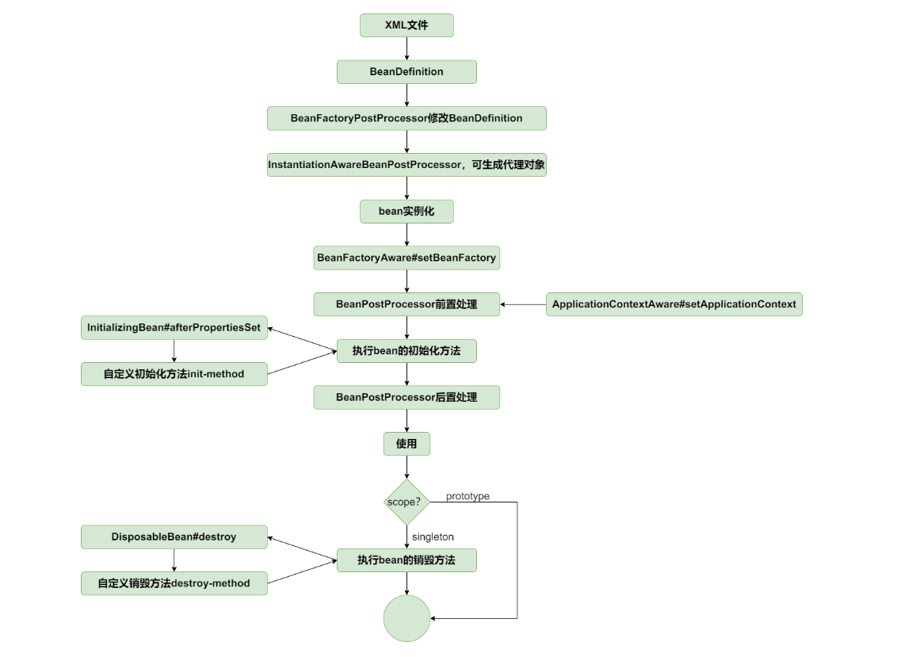

1.由用户在xml配置文件中注入一个 AspectJExpressionPointcutAdvisor对象，然后配置各种advice属性（MethodInterceptor类）、expression属性

2.然后借助BeanPostProcessor接口的实现类DefaultAdvisorAutoProxyCreator(同时也实现了ApplicationContextAware接口)，同样也是通过xml配置文件注入的，执行的逻辑是这样的：

通过BeanFactory的getBeansOfType方法获取到所有的Advisor类对象

然后获取到MethodInterceptor（advice属性）、expression对象，然后构造出来advicedSupport对象，然后根据ProxyFactory类创建对应的代理对象，调用getProxy()获取代理对象

3.然后在什么地方插入这些逻辑呢？AbstractAutowireCapableBeanFactory#createBean()方法中，getBeansOfType()方法获取到所有的BeanPostProcessor，然后判断是否是DefaultAdvisorAutoProxyCreator对象，如果是的话，就调用postProcessBeforeInitialization方法，然后调用getBean()方法获取到所有的Advisor类对象
其实每一个对象在执行到createBean()的时候，都会被判断是否需要生成代理对象！classFilter.matches(beanClass)这个方法用来做过滤的！并且可能存在多个expression，所以会有多个pointcutAdvisor对象！

总结：
1.AbstractAutowireCapableBeanFactory类的createBean()方法，createBean() -> resolveBeforeInstantiation() -> applyBeanPostProcessorsBeforeInitialization()方法

2.getPostProcessors()方法获取到所有的BeanPostProcessor类，取出来特定类型的(InstantiationAwareBeanPostProcessor)，然后调用该类中的postProcessBeforeInstantiation()方法，用来创建代理对象！

3.会getBeansOfType()方法获取到所有的Advisor类对象，从类对象身上获取execution切点表达式，advice增强类

4.然后调用BeanPostProcessor类的postProcessAfterInitialization()方法 -> 后置处理器

主要是在createBean()方法中新增一条路线，之前是通过doCreateBean()通过实例化->属性注入->初始化做的。现在是直接通过创建代理对象

因为创建代理对象实在createBean()方法中，此时所有的beanPostProcessor类已经创建好了，就可以提前拿出来使用。
