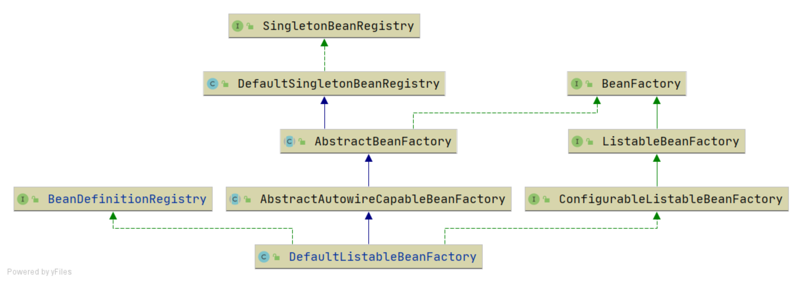
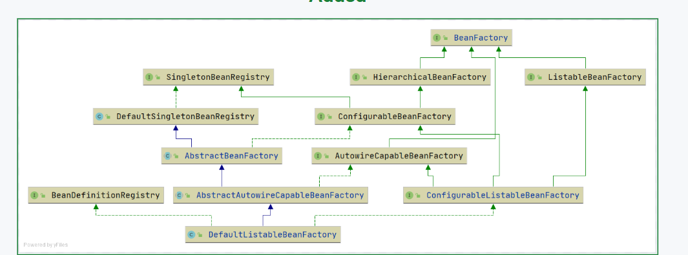

xml文件定义 --- xml-file-define-bean

这一次提交主要是为了BeanFactoryPostProcessor 接口 和  BeanPostProcessor 接口 做准备的！

之前的继承实现关系：

现在的继承实现关系：
 

一、【继承关系变化】：

1.新增HierarchyBeanFactory接口、ConfigurableBeanFactory接口、AutowireCapableBeanFactory接口

2.AbstractBeanFactory类不再直接实现BeanFactory接口，而是实现ConfigurableBeanFactory接口。

3.ConfigurableListableBeanFactory接口移除preInstantiateSingletons()提前实例化所有bean方法，对应的实现类DefaultListableBeanFactory中也移除这个方法。

4.ConfigurableListableBeanFactory接口新增两个继承接口：ConfigurableBeanFactory和AutowireCapableBeanFactory接口

5.AbstractAutowireCapableBeanFactory类新增一个实现接口：AutowireCapableBeanFactory

二、【新增方法变化】
1.BeanFactory接口中新增了getBean(String name, Class<T> requiredType)，根据名称和类型获取bean。
然后在AbstractBeanFactory类中实现这个方法。

2.ConfigurableBeanFactory接口中新增addBeanPostProcessor()方法，在进行实例化之前会检查有没有BeanPostProcessor类，如果有的话就执行这个类的方法！（一般是对BeanDefinition进行修改的）

3.AutowireCapableBeanFactory接口中新增 applyBeanPostProcessorsBeforeInitialization()方法 和 applyBeanPostProcessorAfterInitialization()方法,和BeanPostProcessor搭配使用的