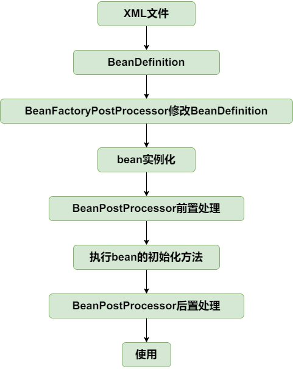

【应用上下文ApplicationContext   application-context】

一、首先定位一下ApplicationContext的位置。
作为一个比BeanFactory更先进的IOC容器，它还提供了一些其他高级功能，包括对BeanFactoryPostProcessor 和  BeanPostProcessor类的自动识别；资源加载；容器事件和监听器；国际化支持等

二、概括一下这章主要干了什么：

1.新增以下类 AbstractApplicationContext 、 AbstractRefreshApplicationContext 、 AbstractXmlApplicationContext 、 ClassPathXmlApplicationContext

目前的实现继承的关系为：

    ApplicationContext接口 -> ConfigurableApplicationContext接口（新增refresh方法） -> AbstractApplicationContext -> AbstractRefreshApplicationContext -> AbstractXmlApplicationContext -> ClassPathXmlApplicationContext

2.其实主要的工作就是围绕refresh()方法进行的。refresh方法的作用包括哪些？
    
    a.从配置文件中加载BeanDefinition -> refreshBeanFactory()方法

    b.获取ConfigurableListableBeanFactory类，实例化BeanFactoryPostProcessor类，并且执行postProcessBeanFactory()方法  -> invokeBeanFactoryPostProcessors()方法

    c.实例化BeanPostProcessor类，执行addBeanPostProcessor()方法，（在AbstractAutowireCapableBeanFactory进行doCreateBean()的时候就会获取到beanPostProcessor，然后执行他们的before、after方法）  -> registerBeanPostProcessors()方法

    d.提前实例化所有的单例bean ->  beanFactory.preInstantiateSingletons()方法

3. 然后按照每一个步骤分析一下，是如何将这些bean类串联起来的！

    a.AbstractApplicationContext实现的refresh()方法中，其中留下了两个抽象方法，等着子类去实现！为refreshBeanFactory()方法、getBeanFactory()方法。主要对应我们方法的第一步和第二步

    b.然后AbstractRefreshApplicationContext类实现了refreshBeanFactory()方法，但是并没有完全实现，还是留下来一个抽象方法，loadDefinition()方法

    c.然后到了AbstractXmlApplicationContext类中，实现了loadDefinition()方法，但是也并没有完全实现，因为需要资源的路径，所以留下来了一个抽象的方法getConfigLocations()。

    d.最后具体的实现类ClassPathXmlApplicationContext类中实现了getConfigLocations()方法，将configLocations作为他的一个属性，由调用方传递过来。并且在构造方法中还调用了refresh（）方法！

4.从用户的角度分析一下来 <=> 小总结

    
    a.用户提供一个资源路径，然后调用refresh()方法，refresh()方法中一共包括四步。 refreshBeanFactory()方法 -> invokeBeanFactoryPostProcessors()方法 -> registerBeanPostProcessors()方法 -> beanFactory.preInstantiateSingletons()方法

    b.refreshBeanFactory()方法中会先创建一个BeanFactory，然后根据传入的路径对xml配置文件处理，注册BeanDefinition到Map中！

    c.然后执行invokeBeanFactoryPostProcessors()方法，会调用getBeansOfType()方法，这个方法会从BeanDefinitionMap中获取和传入的Class类型相同的BeanDefinition，然后获取到beanName，再次调用getBean()方法，进行实例化，属性赋值，beanFactoryPostProcessor ...

    d.addBeanPostProcessor()方法，会调用getBeansOfType()方法，获取到对应的beanName,然后调用getBean()方法，进行实例化，不过这里会执行BeanFactoryProcessor的方法！实例化完成之后，会执行addBeanPostProcessor()方法。

    c.最后实例化所有的单例Bean（会涉及到 getBean()方法 -> createBean() -> doCreateBean() -> 实例化、属性注入）

    